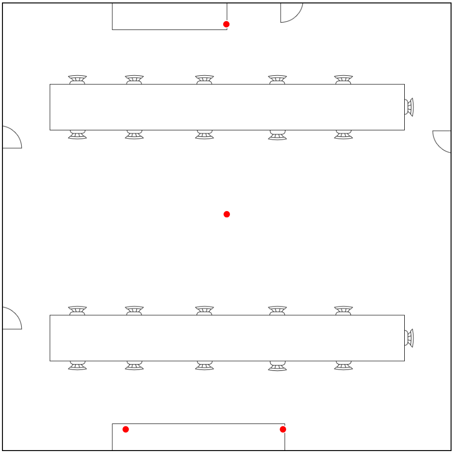

# <u>Simulación de posicionamiento en interiores con RSSI</u>
Se trata de realizar una simulación en tiempo real y en un entorno físico. Para ello se propone colocar 4 beacons distribuidas en la sala de innovación (A = 115 m²) tal y como se muestra en la siguiente imagen:
<p align="center">


## ⚠️ <u> Código de ejecución</u>
Con el código `main.py` se ejecuta el interfaz con ambas opciones de posicionamiento. Activa el interfaz principal y los paneles correspondientes a cada método. La construcción individual de cada panel se hace en el propio código de los métodos.
```bash

from nicegui import ui
from seccion_fingerprinting import build_seccion_fingerprinting
from seccion_trilateracion import build_seccion_trilateracion

ui.page_title('Bluetooth Indoor Positioning')

with ui.header().classes('items-center justify-between'):
    ui.label('Bluetooth Indoor Positioning').classes('text-2xl font-bold')

with ui.tabs().classes('w-full') as tabs:
    fingerprinting = ui.tab('Fingerprinting')
    trilateracion = ui.tab('Trilateración')

with ui.tab_panels(tabs, value=fingerprinting).classes('w-full'):
    with ui.tab_panel(fingerprinting):
        build_seccion_fingerprinting()


    with ui.tab_panel(trilateracion):
        build_seccion_trilateracion()
ui.run()

```
## 📐 <u> Método Trilateración</u>
### 🛠️ Requisitos 
```bash
from nicegui import ui
import numpy as np
import threading
import queue
from scipy.ndimage import gaussian_filter
#import configparser # Descomentar para usar el archivo config.ini
from adafruit_ble import BLERadio
from adafruit_ble.advertising.standard import ProvideServicesAdvertisement
from adafruit_ble.services.nordic import UARTService
```

### 🧭 Simulación de la trayectoria del nodo
Para el desarrollo de la simulación en un entorno físico, en primer lugar se realiza una función `trilateracion_3d()` para estimar la posición del nodo teniendo en cuenta los valores `RSSI` del nodo con respecto a las beacons colocadas por la sala de innovación como se muestra anteriormente. Las posiciones finales estimadas serán las resultante de hacer la trilateración. Para la trilateración, se realiza con respecto a todas las beacons del escenario (xi, yi, zi, ri) y se utiliza como referencia la posición XYZ (x0, y0, z0) de la beacon de la cual se obtiene el mayor RSSI y la distancia (r0) del nodo a dicha beacon.

Para la obtención de los valores RSSI es necesario incluir los módulos `adafruit_ble`, `adafruit_ble.advertising.standard` y `adafruit_ble.advertising.nordic`. Se han tomado los address de las beacons para clasificar los RSSI recibidos por cada una, de esta manera se evita utilizar RSSI de otros equipos externos. 

Para la visualización y personalización del interfaz se utiliza la librería `nicegui`. El interfaz se compone de una tabla de con los valores `RSSI` de cada baliza, la posición estimada del nodo, la imagen o plano del lugar, y la representación de las balizas y el nodo en el plano.

```bash
q = queue.Queue()
escaneo = False
ble = BLERadio()
puntos_beacons2 = ""
punto_nodo2 = ""
puntos_acumulados = ""

def obtener_arg_tri():

    # Usar archivo config.ini para la modificación de los valores de las variables
    # config = configparser.ConfigParser()
    # config.read('config.ini')
    # address_beacons = list(config['beacons_add'].values())
    # num_beacons = int(config['beacons_pos']['num_beacons'])
    # x_beacons = [float(x) for x in config['beacons_pos']['x_beacons'].split(',')]
    # y_beacons = [float(y) for y in config['beacons_pos']['y_beacons'].split(',')]
    # z_beacons = [float(z) for z in config['beacons_pos']['z_beacons'].split(',')]
    # txpower = float(config['datos']['txpower'])
    # n = float(config['datos']['n'])


    B1 = "FE:2F:2E:23:53:2F"
    B2 = "F9:AA:8D:12:63:70"
    B3 = "ED:6F:72:1B:F1:83"
    B4 = "DC:04:2E:9D:49:62"

    address_beacons = [B1,B2,B3,B4]
    num_beacons = 4
    x_beacons = [5.36,5.35,2.95,6.7]
    y_beacons = [5.06,0.52,10.2,10.2]
    z_beacons = [2.2,1.9,1.9,1.9]

    txpower=-65
    n=1.8
    arg_tri = (address_beacons,num_beacons,x_beacons,y_beacons,z_beacons,txpower,n)
    return arg_tri


def trilateracion_3d(rssi_n,x_beacons,y_beacons,z_beacons,txpower,n):

    xi=[]
    yi=[]
    zi=[]
    ri=[]


    indice = np.nanargmax(rssi_n)
    r0 = 10**((txpower-rssi_n[indice])/(10*n))
    x0, y0, z0 = x_beacons[indice], y_beacons[indice], z_beacons[indice]

    for i in range(len(x_beacons)):
        if i != indice and not np.isnan(rssi_n[i]):
            xi.append(x_beacons[i])
            yi.append(y_beacons[i])
            zi.append(z_beacons[i])
            d = (10**((txpower-rssi_n[i])/(10*n)))
            ri.append(d)

    xi = np.array(xi)
    yi = np.array(yi)
    zi = np.array(zi)
    ri = np.array(ri)
    
    A = np.column_stack([2*(xi - x0), 
                         2*(yi - y0),
                         2*(zi - z0),
                         ])
    B = (xi**2 + yi**2 + zi**2 - ri**2) - (x0**2 + y0**2 + z0**2 - r0**2)

    posiciones, residuals, rank, s  = np.linalg.lstsq(A, B, rcond=None)
    return posiciones[0],posiciones[1],posiciones[2]


def func_boton():
    global escaneo
    
    if escaneo:
        ui.notify("Ya está escaneando")
        return
    
    escaneo = True
    arg_tri = obtener_arg_tri()
    t2 = threading.Thread(target=simulacion_trilateracion,args=arg_tri,daemon=True)
    t2.start()
    ui.notify("Empieza a escanear")


def simulacion_trilateracion(address_beacons,num_beacons,x_beacons,y_beacons,z_beacons,txpower,n):


    address_indice = {addr: i for i, addr in enumerate(address_beacons)}
    rssi_n = np.zeros(num_beacons)
    array_rssi = [[] for i in range(num_beacons)]

    scanner = ble.start_scan(ProvideServicesAdvertisement)
    for advertisement in scanner:
        if UARTService in advertisement.services:
                rssi = advertisement.rssi
                address = str(advertisement.address).split('"')[1]
                if address in address_beacons:
                    indice = address_indice[address]
                    array_rssi[indice].append(rssi)

                    if sum(len(col) >= 5 for col in array_rssi)>=4:
                        for i in range(num_beacons):
                            datos = np.array(array_rssi[i])

                            # Filtro gaussiano para evitar fluctuaciones
                            aux = gaussian_filter(datos, sigma=1)
                            valores = np.sort(aux.flatten())
                            if len(valores) > 4: 
                                val=valores[2:-2]
                                media = np.mean(val)
                                rssi_n[i] = np.round(media,2)
                            else:
                                media = np.mean(valores)
                                rssi_n[i] = np.round(media,2)
                            array_rssi[i] = []
                        Xi,Yi,Zi = trilateracion_3d (rssi_n,x_beacons,y_beacons,z_beacons,txpower,n)
                        q.put((rssi_n.copy(),Xi,Yi))


def actualizar_tabla_rssi():
    global puntos_beacons2, puntos_acumulados

    if not q.empty():
        rssi_n,Xi,Yi = q.get()
        for i, rssi in enumerate(rssi_n):
            filas[i]['RSSI'] = rssi

        tabla.rows = list(filas)
        label_x.set_text(f'X: {Xi:.2f} m')
        label_y.set_text(f'Y: {Yi:.2f} m')
        px2 = (Xi * 700)/10.72
        py2 = (Yi * 699.283)/10.72
        x_svg2, y_svg2 = ajuste(px2, py2)
        punto_nodo2 = f'<circle cx="{x_svg2}" cy="{y_svg2}" r="8" fill="blue" stroke="white" stroke-width="2" />'
        puntos_acumulados += punto_nodo2
        imagen_plano.content = puntos_beacons2 + punto_nodo2 # Visualmente en movimiento 
        #imagen_plano.content = puntos_beacons2 + puntos_acumulados # Marcar el recorrido


def ajuste(x, y):
 
    w_img = 700
    h_img = 699.281
 
    w_img_real = 980
    h_img_real = 979
 
    # SVG para que la posición de los puntos estén en proporción a la imagen
    x_svg = x * w_img_real / w_img
    y_svg = y * h_img_real / h_img
 
    return x_svg, y_svg
 


def build_seccion_trilateracion():
    global filas, tabla, label_x, label_y, x_beacons, y_beacons,imagen_plano,width, puntos_beacons2
    width = '700px'

    address_beacons,num_beacons,x_beacons,y_beacons,z_beacons,txpower,n = obtener_arg_tri()

    filas = [
        {'Balizas': f'Baliza {i+1}', 'RSSI' : ''} for i in range(num_beacons)
        ]
    
    with ui.row().style("flex-wrap: nowrap; width: 100%").classes('gap-2'):
        with ui.column().classes('flex-[1]'):

            ui.label('TRILATERACIÓN').classes('text-xl font-bold')

            ui.button('Iniciar posicionamiento', on_click=func_boton)

            ui.label('RSSI de las balizas detectadas')

            tabla = ui.table(
                columns=[
                    {'name':'Balizas','label':'Balizas','field':'Balizas'},
                    {'name':'RSSI','label':'RSSI','field':'RSSI'},
                ],
                rows=filas
            )

            ui.label('Posición estimada:')
            label_x = ui.label(f'X: -- m')
            label_y = ui.label(f'Y: -- m')

        with ui.column().classes('flex-[2]'):
            ui.label('SALA DE INNOVACIÓN').classes('text-lg')
            imagen_plano = ui.interactive_image('sala_innovacion.png').style(f'width: {width}')

            puntos_beacons2 = ""
            for x, y in zip(x_beacons, y_beacons):
                px = (x * 700)/10.72
                py = (y * 699.283)/10.72
                x_svg, y_svg = ajuste(px, py)
                puntos_beacons2 += ''.join(f'<circle cx="{x_svg}" cy="{y_svg}" r="8" fill="red" stroke="white" stroke-width="2" />')
            imagen_plano.content = puntos_beacons2

    ui.timer(0.1,actualizar_tabla_rssi)

```
## 📍<u>Método FingerPrinting</u>
### 🛠️ Requisitos 
```bash
from nicegui import ui
import pandas as pd
import numpy as np
import threading
import queue
from scipy.ndimage import gaussian_filter
# import configparser # Descomentar para usar el archivo config.ini
from adafruit_ble import BLERadio
from adafruit_ble.advertising.standard import ProvideServicesAdvertisement
from adafruit_ble.services.nordic import UARTService
from muestras import muestreo
```

### 🧭 Simulación de la trayectoria del nodo
Para el desarrollo de esta simulación en un entorno físico, en primer lugar se realiza una función `posicionamiento()` para estimar la posición del nodo teniendo en cuenta los valores `RSSI` del nodo con respecto a las beacons colocadas por la sala de innovación. Las posiciones finales estimadas serán las resultante de hacer FingerPrinting. Para este método, se realiza un muestreo de la sala donde se recoge los valores RSSI de cada muestra con respecto a beacons, utilizando el codigo `FigerPrinting.py`.

Para la obtención de los valores RSSI es necesario incluir los módulos `adafruit_ble`, `adafruit_ble.advertising.standard` y `adafruit_ble.advertising.nordic`. Se han tomado los address de las beacons para clasificar los RSSI recibidos por cada una, de esta manera se evita utilizar RSSI de otros equipos externos. 

Para la visualización y personalización del interfaz se utiliza la librería `nicegui`. El interfaz se compone de una tabla de con los valores `RSSI` de cada baliza, la posición estimada del nodo, la imagen o plano del lugar, y la representación de las balizas y el nodo en el plano.

Además, se requiere de dos archivos excel, uno en el caso del muestreo en el que se debe de modificar las posiciones XY para las muestras que se vayan a tomar (`archivos_adjuntos/setup.xlsx`) y otro en el que se encuentre la información del FingerPrinting del área (`archivos_adjuntos/escenario.xlsx`)

```Bash

q1 = queue.Queue()
escaneo = False
ble = BLERadio()
puntos_beacons = ""
punto_nodo = ""
puntos_acumulados = ""

def obtener_arg_fp():

    # config = configparser.ConfigParser()
    # config.read('config.ini')
    # x_beacons = [float(x) for x in config['beacons_pos']['x_beacons'].split(',')]
    # y_beacons = [float(y) for y in config['beacons_pos']['y_beacons'].split(',')]
    # z_beacons = [float(z) for z in config['beacons_pos']['z_beacons'].split(',')]
    # address_beacons = list(config['beacons_add'].values())
    # num_beacons = int(config['beacons_pos']['num_beacons'])

    B1 = "FE:2F:2E:23:53:2F"
    B2 = "F9:AA:8D:12:63:70"
    B3 = "ED:6F:72:1B:F1:83"
    B4 = "DC:04:2E:9D:49:62"

    address_beacons = [B1,B2,B3,B4]
    num_beacons = 4
    x_beacons = [5.36,5.35,2.95,6.7]
    y_beacons = [5.06,0.52,10.2,10.2]
    z_beacons = [2.2,1.9,1.9,1.9]

    return address_beacons,num_beacons,x_beacons,y_beacons


def func_boton_adj(): 
    global escaneo 
    if escaneo: 
        ui.notify("Ya está escaneando") 
        return 
    escaneo = True 
    ruta = 'archivos_adjuntos/escenario.xlsx' #Archivo de las coordenadas XY y RSSI de las muestras del FingerPrinting 
    df = pd.read_excel(ruta) 
    escenario = df.to_dict(orient='list') 
    address_beacons, num_beacons,x_beacons,y_beacons = obtener_arg_fp() 
    arg_fp = (address_beacons,num_beacons,escenario) 
    t3 = threading.Thread(target=simulacion_fingerprinting,args=arg_fp,daemon=True) 
    t3.start() 
    ui.notify("Iniciando escaneo...")

def func_boton_muestreo():
    global escaneo
    if escaneo: 
        ui.notify("Ya está escaneando")
        return
    
    escaneo = True
    muestras_pos = 'archivos_adjuntos/setup.xlsx' #Archivo de las coordenadas XY de las muestras del FingerPrinting

    address_beacons, num_beacons,x_beacons,y_beacons = obtener_arg_fp()
    escenario = muestreo()

    arg_fp = (address_beacons,num_beacons,escenario)
    t1 = threading.Thread(target=simulacion_fingerprinting,args=arg_fp,daemon=True)
    t1.start()


def posicionamiento (rssi_n,escenario):
    # Se calcula la distancia entre el nodo y los puntos del FingerPrinting
    # Se devuelve las coordenadas XY del punto más cercano
    aux=[]
    x_vecino=[]
    y_vecino=[]
    rssi_vecino=[]
    distancia=[]
    columnas_rssi=[]

    for col in escenario.keys():
        if col.startswith('RSSI'):
            columnas_rssi.append(col)
    
    for i in range(len(escenario['x'])):
        escenario_rssi = np.array([escenario[col][i] for col in columnas_rssi])
        distancia = np.linalg.norm(rssi_n - escenario_rssi)

        aux.append(round(float(distancia), 2))

    indice = np.argsort(aux)[:1]
    j = indice[0]
    x_vecino.append(escenario['x'][j])
    y_vecino.append(escenario['y'][j])
    rssi_vecino.append([escenario[col][j] for col in columnas_rssi])

    return x_vecino,y_vecino


def simulacion_fingerprinting(address_beacons,num_beacons,escenario):

    address_indice = {addr: i for i, addr in enumerate(address_beacons)}
    rssi_n = np.zeros(num_beacons)
    array_rssi = [[] for i in range(num_beacons)]
    
    # Obtener el RSSI con respecto a las beacons y calcular la posición del nodo mediante la FingerPrinting
    # while True:
    #     for advertisement in ble.start_scan(ProvideServicesAdvertisement, timeout=1):
    scanner = ble.start_scan(ProvideServicesAdvertisement)
    for advertisement in scanner:
        if UARTService in advertisement.services:
            rssi = advertisement.rssi
            address = str(advertisement.address).split('"')[1]
            if address in address_beacons:
                indice = address_indice[address]
                array_rssi[indice].append(rssi)

                if sum(len(col) >= 5 for col in array_rssi)>=4:
                    for i in range(num_beacons):
                        datos = np.array(array_rssi[i])

                        # Filtro gaussiano para evitar fluctuaciones
                        aux = gaussian_filter(datos, sigma=1)
                        valores = np.sort(aux.flatten())
                        if len(valores) > 4: 
                            val=valores[2:-2]
                            media = np.mean(val)
                            rssi_n[i] = np.round(media,2)
                        else:
                            media = np.mean(valores)
                            rssi_n[i] = np.round(media,2)
                        array_rssi[i] = []
                    Xi,Yi = posicionamiento (rssi_n,escenario)
                    q1.put((rssi_n.copy(),Xi,Yi))


def actualizar_tabla_rssi():
    global puntos_beacons, puntos_acumulados

    if not q1.empty():
        rssi_n,Xi,Yi = q1.get()
        for i, rssi in enumerate(rssi_n):
            filas[i]['RSSI'] = rssi

        tabla.rows = list(filas)
        label_x.set_text(f'X: {Xi[0]:.2f} m')
        label_y.set_text(f'Y: {Yi[0]:.2f} m')
        px = (Xi[0] * 700)/10.72
        py = (Yi[0] * 699.283)/10.72
        x_svg, y_svg = ajuste(px, py)
        punto_nodo = f'<circle cx="{x_svg}" cy="{y_svg}" r="8" fill="blue" stroke="white" stroke-width="2" />'
        imagen_plano.content = puntos_beacons + punto_nodo
        puntos_acumulados += punto_nodo
        #imagen_plano.content = puntos_beacons + punto_nodo # Visualmente en movimiento
        imagen_plano.content = puntos_beacons + puntos_acumulados # Marcar  recorrido

def ajuste(x, y):
 
    w_img = 700
    h_img = 699.281
 
    w_img_real = 980
    h_img_real = 979
 
    # SVG para que la posición de los puntos estén en proporción a la imagen
    x_svg = x * w_img_real / w_img
    y_svg = y * h_img_real / h_img
 
    return x_svg, y_svg


def build_seccion_fingerprinting():
    global filas, tabla, label_x, label_y, x_beacons, y_beacons,imagen_plano,width, puntos_beacons
    width = '700px'

    address_beacons, num_beacons,x_beacons,y_beacons = obtener_arg_fp()
    filas = [
        {'Balizas': f'Baliza {i+1}', 'RSSI' : ''} for i in range(num_beacons)
        ]
    
    with ui.row().style("flex-wrap: nowrap; width: 100%").classes('gap-2'):
        with ui.column().classes('flex-[1]'):
            ui.label('FINGERPRINTING').classes('text-xl font-bold')
            
            ui.button('Cargar Fingerprinting', on_click=func_boton_adj)

            ui.button('Iniciar muestreo', on_click=func_boton_muestreo)

            ui.label('RSSI de las balizas detectadas')

            tabla = ui.table(
                columns=[
                    {'name':'Balizas','label':'Balizas','field':'Balizas'},
                    {'name':'RSSI','label':'RSSI','field':'RSSI'},
                ],
                rows=filas
            )
            ui.label('Posición estimada:')
            label_x = ui.label(f'X: -- m')
            label_y = ui.label(f'Y: -- m')

        with ui.column().classes('flex-[2]'):
            ui.label('SALA DE INNOVACIÓN').classes('text-lg')
            imagen_plano = ui.interactive_image('sala_innovacion.png').style(f'width: {width}')
            #height = obtener_height()
            puntos_beacons = ""
            for x, y in zip(x_beacons, y_beacons):
                px = (x * 700)/10.72
                py = (y * 699.283)/10.72
                x_svg, y_svg = ajuste(px, py)
                puntos_beacons += ''.join(f'<circle cx="{x_svg}" cy="{y_svg}" r="8" fill="red" stroke="white" stroke-width="2" />')
            imagen_plano.content = puntos_beacons

    ui.timer(0.1,actualizar_tabla_rssi)

```
### 📊 Muestreo
Con este codigo se trata de realiar el muestreo para el caso de FingerPrinting. Está controlado por un `input`, para que cuando se cambie e posición entre muestra y muestra, se controle manualmente, ya que el tiempo de movimiento podría condicionar la medida.

```bash
import pandas as pd
import numpy as np
from scipy.ndimage import gaussian_filter
from adafruit_ble import BLERadio
from adafruit_ble.advertising.standard import ProvideServicesAdvertisement
from adafruit_ble.services.nordic import UARTService

ble = BLERadio()

def cargar(escenario,num_beacons,rssi_n):
    for h in range(num_beacons):
        escenario[f'RSSI{h}'].append(rssi_n[h])
    input("Pulsa ENTER cuando hayas cambiado al siguiente punto...")    

    
def muestreo():
    B1 = "FE:2F:2E:23:53:2F"
    B2 = "F9:AA:8D:12:63:70"
    B3 = "ED:6F:72:1B:F1:83"
    B4 = "DC:04:2E:9D:49:62"
    address_beacons = [B1,B2,B3,B4]
    num_beacons = 4
    address_indice = {addr: i for i, addr in enumerate(address_beacons)}
    rssi_n = np.zeros(num_beacons)
    array_rssi = [[] for i in range(num_beacons)]
    escenario = simulacion()
    j=0

    # Obtener y guardar el RSSI con respecto a las beacons
    scanner = ble.start_scan(ProvideServicesAdvertisement)
    for advertisement in scanner:
        if UARTService in advertisement.services:
            rssi = advertisement.rssi
            address = str(advertisement.address).split('"')[1]
            if address in address_beacons:
                indice = address_indice[address]
                array_rssi[indice].append(rssi)
                if all(len(col) >= 5 for col in array_rssi):
                    for h in range(num_beacons):
                        datos = np.array(array_rssi[h])

                        # Filtro gaussiano para evitar fluctuaciones
                        aux = gaussian_filter(datos, sigma=1)
                        valores = np.sort(aux.flatten())
                        val=valores[2:-2]
                        media = np.mean(val)
                        rssi_n[h] = media

                    if np.any(rssi_n == 0): # Esperar a recibir RSSI de todas la beacons para tomar las muestras
                            print("Todavia no se ha recibido RSSI de todas las balizas: ",rssi_n)
                    
                    else: # Tomar las muestras
                        if j < len((escenario['x'])):                      
                            cargar(escenario,num_beacons,rssi_n)
                            j += 1
                            array_rssi = [[] for i in range(num_beacons)]

        if len(escenario['RSSI0']) == len(escenario['x']):
            break

    escenario_df = pd.DataFrame(escenario)
    escenario_df.to_excel('muestras.xlsx', index=False)
    return escenario


def simulacion():
    num_beacons=4
    muestras_pos = 'archivos_adjuntos/setup.xlsx' #Archivo de las coordenadas XY de las muestras del FingerPrinting
    df = pd.read_excel(muestras_pos)
    escenario = df.to_dict('list')
    for j in range (num_beacons):
        escenario[f'RSSI{j}'] = []
    return escenario

if __name__ == "__main__":
    escenario_comp = muestreo()
    #print(escenario_comp)
```