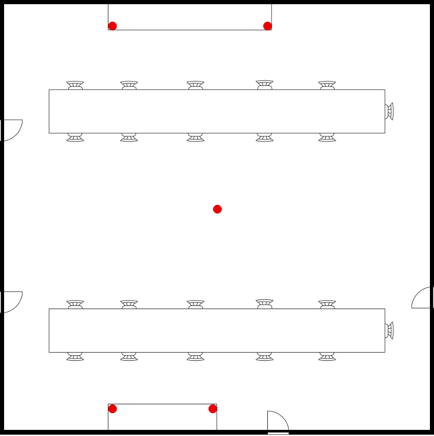

# <u>Simulación de posicionamiento en interiores con RSSI</u>
Se trata de realizar una simulación en tiempo real y en un entorno físico. Para ello se propone colocar 5 beacons distribuidas en la sala de innovación (A = 115 m²) tal y como se muestra en la siguiente imagen:
<p align="center">


## 📐 <u> Método Trilateración</u>
### 🛠️ Requisitos 
```bash
import numpy as np
import matplotlib.pyplot as plt
from scipy.ndimage import gaussian_filter
import threading
import queue
from adafruit_ble import BLERadio
from adafruit_ble.advertising.standard import ProvideServicesAdvertisement
```

### 🧭 Simulación de la trayectoria del nodo
Para el desarrollo de la simulación en un entorno físico, en primer lugar se realiza una función `trilateracion_3d()` para estimar la posición del nodo teniendo en cuenta los valores `RSSI` del nodo con respecto a las beacons colocadas por la sala de innovación como se muestra anteriormente. Las posiciones finales estimadas serán las resultante de hacer la trilateración. Para la trilateración, se realiza con respecto a todas las beacons del escenario (xi, yi, zi, ri) y se utiliza como referencia la posición XYZ (x0, y0, z0) de la beacon de la cual se obtiene el mayor RSSI y la distancia (r0) del nodo a dicha beacon.

Para la obtención de los valores RSSI es necesario incluir los módulos `adafruit_ble` y `adafruit_ble.advertising.standard`. Se han tomado los address de las beacons para clasificar los RSSI recibidos por cada una, de esta manera se evita utilizar RSSI de otros equipos externos. 

```bash

q = queue.Queue() # Para comunicación con el hilo t1, y poder visualizar los datos obtenidos

def trilateracion_3d(rssi_n,x_beacons,y_beacons,z_beacons):

    n = 2.5
    txpower=-65
    xi=[]
    yi=[]
    zi=[]
    ri=[]

    indice = np.argmax(rssi_n)
    r0 = 10**((txpower-rssi_n[indice])/(10*n))
    x0, y0, z0 = x_beacons[indice], y_beacons[indice], z_beacons[indice]

    for i in range(len(x_beacons)):
        if i != indice:
            xi.append(x_beacons[i])
            yi.append(y_beacons[i])
            zi.append(z_beacons[i])
            d = (10**((txpower-rssi_n[i])/(10*n))) # Distancia del nodo a las beacons
            ri.append(d)

    xi = np.array(xi)
    yi = np.array(yi)
    zi = np.array(zi)
    ri = np.array(ri)
    
    A = np.column_stack([2*(xi - x0), 
                         2*(yi - y0),
                         2*(zi - z0),
                         ])
    B = (xi**2 + yi**2 + zi**2 - ri**2) - (x0**2 + y0**2 + z0**2 - r0**2)

    posiciones, residuals, rank, s  = np.linalg.lstsq(A, B, rcond=None)
    return posiciones[0],posiciones[1],posiciones[2]


def run_simulacion():

    # Dimensiones del setup y posiciones de las balizas
    area_inn = 115 # Área de la sala de innovación
    lado =  np.sqrt(area_inn)
    b1 = [lado/2,(lado/2)-0.3,2.2]
    b2 = [5.35,0.52,1.9]
    b3 = [2.95,lado-0.52,1.9]
    b4 = [6.7,lado-0.52,1.9]
    b5 = [2.95,0.52,1.9]

    x_beacons=[b1[0],b2[0],b3[0],b4[0],b5[0]]
    y_beacons=[b1[1],b2[1],b3[1],b4[1],b5[1]]
    z_beacons=[b1[2],b2[2],b3[2],b4[2],b5[2]]

    # Address de las 5 beacons
    ble = BLERadio()
    B1 = "FE:2F:2E:23:53:2F"
    B2 = "F9:AA:8D:12:63:70"
    B3 = "ED:6F:72:1B:F1:83"
    B4 = "DC:04:2E:9D:49:62"
    B5 = "D6:F4:62:94:9C:6A"
    address_beacons = [B1,B2,B3,B4,B5]
    num_beacons = len(address_beacons)
    address_indice = {addr: i for i, addr in enumerate(address_beacons)}
    rssi_n = np.zeros(num_beacons)

    array_rssi = [[] for i in range(num_beacons)]

    # Obtener el RSSI con respecto a las beacons y calcular la posición del nodo mediante la trilateración
    while True:
        for advertisement in ble.start_scan(ProvideServicesAdvertisement, timeout=1):
            #if UARTService in advertisement.services:
            rssi = advertisement.rssi
            address = str(advertisement.address).split('"')[1]
            if address in address_beacons:
                indice = address_indice[address]
                #rssi_n[indice] = rssi

                array_rssi[indice].append(rssi)
                if len(array_rssi[indice]) == 10:
                    datos = np.array(array_rssi[indice])

                    # Filtro gaussiano para evitar fluctuaciones
                    aux = gaussian_filter(datos, sigma=1)
                    valores = np.sort(aux.flatten())
                    val=valores[3:-3]
                    media = np.mean(val)
                    rssi_n[indice] = media

                    Xi,Yi,Zi = trilateracion_3d (rssi_n,x_beacons,y_beacons,z_beacons) # Estimación de la posición
                    array_rssi[indice] = []

                    q.put((Xi,Yi,Zi))
            
def run_visualizacion():
    # Visualizaicón del posicionamiento en tiempo real
    # Dimensiones del setup y posiciones de las balizas
    area_inn = 115
    lado =  np.sqrt(area_inn)
    b1 = [lado/2,(lado/2)-0.3,2.2]
    b2 = [5.35,0.52,1.9]
    b3 = [2.95,lado-0.52,1.9]
    b4 = [6.7,lado-0.52,1.9]
    b5 = [2.95,0.52,1.9]

    x_beacons=[b1[0],b2[0],b3[0],b4[0],b5[0]]
    y_beacons=[b1[1],b2[1],b3[1],b4[1],b5[1]]
    
    plt.ion()
    fig,ax = plt.subplots(figsize=(10,10))
    imagen = plt.imread("sala_innovacion.png") # Plano de la sala de innovación
    ax.imshow(imagen,extent=[0,lado,0,lado])
    ax.scatter(x_beacons, y_beacons, color='red', marker='s') # Representación de las beacons
    ax.set_title('Sala de innovación')

    punto, = ax.plot([], [], 'bo') 
    while True:
        try:
            Xi, Yi, Zi = q.get()
            punto.set_data([Xi],[Yi]) # Representación de la posición del nodo
            fig.canvas.draw() 
            fig.canvas.flush_events()
        except queue.Empty:
           pass
        plt.pause(0.01)

if __name__ == "__main__":
    t1 = threading.Thread(target=run_simulacion,daemon=True)
    t1.start()

    run_visualizacion()
```
## 📍<u>Método FingerPrinting</u>
### 🛠️ Requisitos 
```bash
import numpy as np
import matplotlib.pyplot as plt
from scipy.ndimage import gaussian_filter
import threading
import queue
import pandas as pd
from adafruit_ble import BLERadio
from adafruit_ble.advertising.standard import ProvideServicesAdvertisement
```

### 🧭 Simulación de la trayectoria del nodo
Para el desarrollo de esta simulación en un entorno físico, en primer lugar se realiza una función `posicionamiento()` para estimar la posición del nodo teniendo en cuenta los valores `RSSI` del nodo con respecto a las beacons colocadas por la sala de innovación. Las posiciones finales estimadas serán las resultante de hacer FingerPrinting. Para este método, se realiza un muestreo de la sala donde se recoge los valores RSSI de cada muestra con respecto a beacons, utilizando el codigo `FigerPrinting.py`.
Para la obtención de los valores RSSI es necesario incluir los módulos `adafruit_ble` y `adafruit_ble.advertising.standard`. Se han tomado los address de las beacons para clasificar los RSSI recibidos por cada una, de esta manera se evita utilizar RSSI de otros equipos externos. 

```Bash
import numpy as np
import pandas as pd
from scipy.ndimage import gaussian_filter
from adafruit_ble import BLERadio
from adafruit_ble.advertising.standard import ProvideServicesAdvertisement


def escenario():
    
    # Address de las 5 beacons
    ble = BLERadio()
    B1 = "FE:2F:2E:23:53:2F"
    B2 = "F9:AA:8D:12:63:70"
    B3 = "ED:6F:72:1B:F1:83"
    B4 = "DC:04:2E:9D:49:62"
    B5 = "D6:F4:62:94:9C:6A"
    address_beacons = [B1,B2,B3,B4,B5]
    num_beacons = len(address_beacons)
    address_indice = {addr: i for i, addr in enumerate(address_beacons)}
    rssi_n = np.zeros(num_beacons)

    array_rssi = [[] for i in range(num_beacons)]
    df = pd.read_excel('setup.xlsx')
    escenario = df.to_dict('list')
    for j in range (num_beacons):
        escenario[f'RSSI{j}'] = []

    # Obtener y guardar el RSSI con respecto a las beacons
    while True:
        for advertisement in ble.start_scan(ProvideServicesAdvertisement, timeout=1):
            rssi = advertisement.rssi
            address = str(advertisement.address).split('"')[1]
            if address in address_beacons:
                indice = address_indice[address]
                array_rssi[indice].append(rssi)
                if len(array_rssi[indice]) == 10:
                    datos = np.array(array_rssi[indice])
                    # Filtro gaussiano para evitar fluctuaciones
                    aux = gaussian_filter(datos, sigma=1)
                    valores = np.sort(aux.flatten())
                    val=valores[3:-3]
                    media = np.mean(val)
                    rssi_n[indice] = media
                    if 0 in rssi_n: # Esperar a recibir RSSI de todas la beacons para tomar las muestras
                            print("Todiavia no se ha recibido RSSI de todas las balizas: ",rssi_n)
                    else: # Tomar las muestras
                        for j in range(len(escenario['x'])):
                            print(j)
                            for i in range(len(address_beacons)):
                                escenario[f'RSSI{i}'].append(rssi_n[i])
                            array_rssi[indice] = []
                            input(f"Siguiente punto...") # Se toma la muestra y pulsar ENTER tras cambiar de punto

        if len(escenario['RSSI0']) == len(escenario['x']):
            break

    # Crear archivo del FingerPRinting
    df2 = pd.DataFrame(escenario)
    df2.to_excel('escenario_.xlsx', index=False)
    print(df2)

if __name__ == "__main__":
    escenario()
```

Para la estimación y visualización de la posición en tiempo real se utiliza el archivo generado `escenario.xlsx` y el código `BLE_FingerPrinting.py`. Modificar el nombre y ruta de los archivos, en este caso se usa las muestras de FingerPrinting ya realizadas de la sala. En el caso de que realizar un nuevo muestre en el código `FingerPrinting.py` modificar el nombre del archivo del `df2`.

```bash
q = queue.Queue()

def posicionamiento (rssi_n,escenario):
    # Se calcula la distancia entre el nodo y los puntos del FingerPrinting
    # Se devuelve las coordenadas XY del punto más cercano
    aux=[]
    x_vecino=[]
    y_vecino=[]
    rssi_vecino=[]
    distancia=[]
    columnas_rssi=[]
    for col in escenario.keys():
        if col.startswith('RSSI'):
            columnas_rssi.append(col)
    for i in range(len(escenario['x'])):
        escenario_rssi = np.array([escenario[col][i] for col in columnas_rssi])
        distancia = np.linalg.norm(rssi_n - escenario_rssi)

        aux.append(round(float(distancia), 2))

    indice = np.argsort(aux)[:1]
    for j in indice:
        x_vecino.append(escenario['x'][j])
        y_vecino.append(escenario['y'][j])
        rssi_vecino.append([escenario[col][j] for col in columnas_rssi])

    return x_vecino,y_vecino

def run_simulacion():

    # Se selecciona el excel con las coordenadas XY de las muestras a recoger
    archivo = '~/setup/escenario.xlsx'
    df = pd.read_excel(archivo)
    escenario = df.to_dict(orient='list')
    ble = BLERadio()
    B1 = "FE:2F:2E:23:53:2F"
    B2 = "F9:AA:8D:12:63:70"
    B3 = "ED:6F:72:1B:F1:83"
    B4 = "DC:04:2E:9D:49:62"
    B5 = "D6:F4:62:94:9C:6A"
    address_beacons = [B1,B2,B3,B4,B5]
    num_beacons = len(address_beacons)
    address_indice = {addr: i for i, addr in enumerate(address_beacons)}
    rssi_n = np.zeros(num_beacons)

    array_rssi = [[] for i in range(num_beacons)]

    while True:
        for advertisement in ble.start_scan(ProvideServicesAdvertisement, timeout=1):
            rssi = advertisement.rssi
            address = str(advertisement.address).split('"')[1]
            if address in address_beacons:
                indice = address_indice[address]
                array_rssi[indice].append(rssi)
                if len(array_rssi[indice]) == 10:
                    datos = np.array(array_rssi[indice])
                    # Filtro gaussiano para evitar fluctuaciones
                    aux = gaussian_filter(datos, sigma=1)
                    valores = np.sort(aux.flatten())
                    val=valores[3:-3]
                    media = np.mean(val)
                    rssi_n[indice] = media
                    Xi,Yi = posicionamiento (rssi_n,escenario) # Estimación de posicionamiento
                    array_rssi[indice] = []
                    # Se mandan las coordenas estimadas para la visualización
                    q.put((Xi,Yi))
            
def run_visualizacion():
    area_inn = 115
    lado =  np.sqrt(area_inn)
    b1 = [lado/2,(lado/2)-0.3,2.2]
    b2 = [5.35,0.52,1.9]
    b3 = [2.95,lado-0.52,1.9]
    b4 = [6.7,lado-0.52,1.9]
    b5 = [2.95,0.52,1.9]

    x_beacons=[b1[0],b2[0],b3[0],b4[0],b5[0]]
    y_beacons=[b1[1],b2[1],b3[1],b4[1],b5[1]]

    plt.ion()
    fig,ax = plt.subplots(figsize=(10,10))
    imagen = plt.imread("sala_innovacion.png") # Plano de la sala de innovación
    ax.imshow(imagen,extent=[0,lado,0,lado])
    ax.scatter(x_beacons, y_beacons, color='red', marker='s') # Representación de las beacons
    ax.set_title('Simulación de posicionamiento')
    ax.set_xlabel('Coordenada X')
    ax.set_ylabel('Coordenada Y')
    punto, = ax.plot([], [], 'bo') 
    while True:
        try:
            Xi, Yi = q.get()
            punto.set_data([Xi],[Yi]) # Representación de la posición estimada en tiempor real
            fig.canvas.draw() 
            fig.canvas.flush_events()
        except queue.Empty:
           pass
        plt.pause(0.01)

if __name__ == "__main__":
    t1 = threading.Thread(target=run_simulacion,daemon=True)
    t1.start()

    run_visualizacion()
´´´